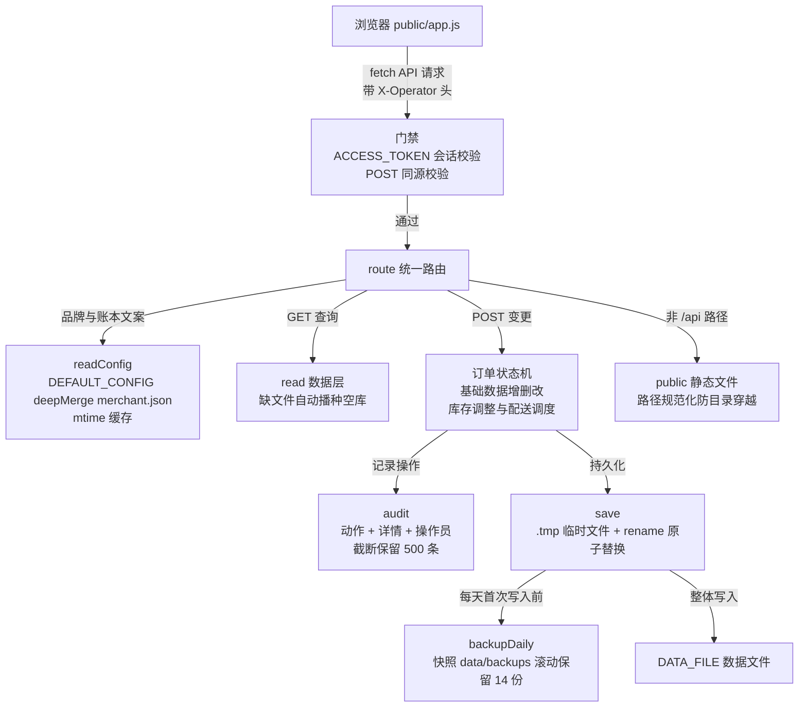

# 本地经营智能助手（多商家适配版）

[](https://github.com/wjh941/chen-sheng-assistant/actions/workflows/test.yml)   

面向中小食品/副食商家的本地经营工作台：在浏览器中完成订单登记、审核、拣货与配送调度，数据全部保存在本机。外部账本（默认适配速达 5000.Online-Pro）仍是正式业务账本，本项目第一阶段不连接、不读取、不修改其数据库。

- **换商家零代码**：换一份商家配置 + 一份数据文件即可，见下方「适配新商家」。
- **当前版本 v0.9.0**：零第三方运行依赖，Node.js ≥ 18。
- **一条命令启动**：`npm start`，浏览器打开 `http://127.0.0.1:3088`。

## 功能

以下能力均可在代码中对应验证（`server.js`、`public/`）：

| 能力 | 说明 |
| --- | --- |
| **七大页面模块** | hash 路由切换：经营总览 `#overview`、订单中心 `#orders`、库存与拣货 `#warehouse`、配送调度 `#delivery`、基础数据 `#master`、经营分析 `#analysis`、系统与账本 `#settings` |
| **品牌与账本全配置化** | 应用名、品牌短名、公司抬头、外部账本名称（如"速达"）均来自 `config/merchant.json`，界面文案（"登记速达单号"等）按配置动态替换 |
| **基础数据管理** | 客户、商品（含别名/单位/成本/安全库存/期初库存）与配送车辆全部在页面上增删改，别名即时生效于订单自动匹配；删除带库存条目的商品需级联确认 |
| **订单登记** | 弹窗录入客户、来源、金额与商品明细；可上传 `.csv`/`.txt`/`.xlsx` 文件（Excel 取第一个工作表，零依赖解析），按"商品,数量,单位"逐行解析，兼容制表符与中英文逗号、跳过表头行；缺数量默认 1，导入与手填行为一致 |
| **订单编辑** | 确认前（待人工确认/异常待审核）可直接修改客户、金额与明细，保存后自动重新匹配商品 |
| **订单中心** | 按状态筛选、关键词搜索、每页 50 条分页加载 |
| **商品与客户匹配** | 商品按名称/SKU/别名匹配，未匹配商品使订单进入"异常待审核"；客户按名称/别名匹配，未匹配客户标记"新客户"（仅提示，不阻断） |
| **订单状态流** | 待人工确认 → 已确认待速达开单 → 已登记速达单号 → 生成拣货任务；未送达的订单可取消并记录原因，已送达订单不能取消。存在未匹配商品时不能确认；未登记速达单号时不能更新配送状态；配送状态只能前进（未安排 → 待配送 → 配送中 → 已送达）。**不存在任何绕过状态机的旁路参数** |
| **拣货校验与库存扣减** | 生成拣货任务时核对本地库存，缺货拒绝并列出缺口；通过后按拣货量自动扣减库存，防止多订单合计超卖；**拣货单/送货单一键打印**（含勾选栏、签字栏与合计金额） |
| **库存调整** | `/api/inventory/adjust` 支持入库 / 出库 / 盘点（设为指定值），全部记录审计 |
| **库存预警与补货建议** | 低于安全库存标红；建议补货量 = 安全库存 × 2 − 现有量，仅作建议、不自动采购 |
| **配送调度** | 车辆路线人工安排 |
| **实时经营分析** | 今日/本月销售额、本月成本、预估毛利全部由本地订单实时汇总（不含已取消订单；成本按商品成本价估算），不使用写死的数字 |
| **操作审计与操作员** | 每次新增/修改记录时间、动作、详情与操作员（页面设置操作员姓名后自动携带，URI 编码传输），自动截断保留最近 500 条；接口可查最近 100 条，页面展示最近 12 条 |
| **数据安全网** | `/api/export` 下载数据副本、`/api/export/orders.xlsx` 导出订单对账 Excel；每日首次写入自动快照到 `data/backups/`（滚动保留 14 份） |
| **可选访问口令** | 设置环境变量 `ACCESS_TOKEN` 后所有页面需登录（内置登录页，HttpOnly Cookie，登出即刻失效所有会话；`/api/health` 保持开放供监控） |
| **前端安全** | 所有动态内容经 HTML 转义渲染，操作按钮走 `data-*` 事件委托，杜绝拼接 `onclick` |
| **健壮性** | 数据文件缺失自动播种空库；文件损坏返回 500 而不崩溃；端口被占用/保留时明确报错退出；30 秒静默自动刷新（弹窗打开或正在输入时不打扰） |

**推荐业务流程**：


## 运行方式

需要 **Node.js 18 或更高版本**，无第三方运行依赖。

```powershell
npm start        # 等价于 node server.js
```

默认监听 `http://127.0.0.1:3088`（仅本机）。局域网共享请显式设置：

```powershell
$env:HOST = "0.0.0.0"; npm start   # 并在防火墙放行 TCP 3088
```

可用环境变量：

| 环境变量 | 默认值 | 说明 |
| --- | --- | --- |
| `PORT` | `3088` | 监听端口；设为 `0` 则随机分配，启动日志输出实际端口 |
| `HOST` | `127.0.0.1` | 监听地址，默认仅本机 |
| `DATA_FILE` | `data/demo.json` | 数据文件路径 |
| `CONFIG_FILE` | `config/merchant.json` | 商家配置路径 |
| `ACCESS_TOKEN` | 未设置 | 可选访问口令，设置后所有页面需登录 |

## 适配新商家（3 步）

```powershell
npm run init -- "商家简称" "外部账本简称"    # 例：npm run init -- "恒达米业" "金蝶"
```

1. 脚本自动生成 `config/merchant-<简称>.json`（品牌与账本配置）和 `data/<简称>.json`（空数据文件）。
2. 按脚本打印的命令设置 `CONFIG_FILE` / `DATA_FILE` 启动服务。
3. 启动后打开「基础数据」页，补齐客户、商品（别名/单位/成本/安全库存/期初库存）与车辆即可营业。

不使用初始化脚本也可以：任意复制一份 `config/merchant.json` 与数据文件，改好内容后用环境变量指向它们。**旧数据迁移**：直接把旧 `DATA_FILE` 指过来即可——旧版订单 ID 可自动反推创建时间，缺失字段会自动兜底。

## 内部逻辑

### 目录结构与职责

```text
chen-sheng-assistant/
├── server.js                  # 唯一入口：路由分发、配置加载、数据读写、每日备份、审计、访问口令
├── lib/
│   └── xlsx.js                # 零依赖 .xlsx 读写：zip 中央目录 + zlib 解压读，STORE 不压缩写
├── scripts/
│   └── init-merchant.js       # 新商家初始化：生成 config/merchant-<简称>.json 与 data/<简称>.json
├── config/
│   └── merchant.json          # 商家品牌与外部账本配置（默认指向，可被 CONFIG_FILE 覆盖）
├── data/
│   └── demo.json              # 业务数据：customers/products/orders/inventory/vehicles/audit
├── public/                    # 前端静态资源，由 server.js 托管
│   ├── index.html             # 页面骨架与侧边栏导航
│   ├── app.js                 # hash 路由七大页面、HTML 转义渲染、X-Operator 头
│   └── style.css              # 样式
├── server.test.js             # node --test 用例：随机端口 + 临时数据副本
├── package.json               # scripts：start/dev/test/check/init；engines 要求 Node >= 18；零 dependencies
└── .github/
    └── workflows/
        └── test.yml           # CI：push/PR 时在 Node 18/20/22 上跑 npm run check + npm test
```

### 模块与数据流



### 关键机制

- **换商家为何零代码**：服务只认 `CONFIG_FILE` / `DATA_FILE` 两个环境变量（`server.js` 启动常量，缺省即 `config/merchant.json` 与 `data/demo.json`）；`readConfig()` 把配置文件 `deepMerge` 到内置 `DEFAULT_CONFIG` 上——允许只写部分字段、按 mtime 缓存（改完即生效）——其中 `erp.short` 决定界面里"登记速达单号"等文案如何替换，所以换商家 = 换一对文件 + 环境变量指向，代码零改动。
- **订单数据写到哪、备份何时触发**：订单/客户/商品/库存/车辆/审计同住一个 JSON 文档；`save()` 先写 `.tmp` 再 `renameSync` 原子替换，且其第一行调用 `backupDaily()`——每天第一次写入前把当前文件快照到 `data/backups/`，按文件名排序滚动删除、只留最近 14 份。
- **访问令牌如何校验**：设置 `ACCESS_TOKEN` 后，除 `/login`、`/logout`、`/api/health` 外全部请求先过门禁；Cookie 里存的是 `HMAC(进程随机密钥, ACCESS_TOKEN)` 而非口令本身，比较走 `crypto.timingSafeEqual` 恒时比较，登出即轮换密钥使所有已发会话立即失效。
- **审计与数据同事务**：每次写操作把 `{time, action, detail, operator}` 前插进数据文档的 `audit` 数组并截断 500 条，随业务数据一起原子落盘，不存在"日志写成功、数据没落盘"的中间态。

## 数据与安全

- **本地存储**：数据保存在 `DATA_FILE`（默认 `data/demo.json`）；写入采用临时文件+原子替换，读取带基于修改时间的内存缓存。
- **不连外部网络**：不调用任何外部网络服务；确认订单、登记速达单号、取消订单、库存调整等重要变更均需人工操作确认。
- **CSRF 防御**：带请求体的 POST 要求 `application/json` 内容类型，且浏览器跨站请求（Origin 与主机不一致）会被拒绝，防御常见 CSRF。
- **XSS 防御**：前端对所有插值做 HTML 转义，杜绝存储型 XSS；服务端读文件失败返回 500 而不崩溃。
- **鉴权现状**：默认无登录鉴权（可选 `ACCESS_TOKEN` 共享口令），默认只监听本机；开放局域网前请确认网络环境可信（角色权限在后续计划中）。
- **备份建议**：生产使用前请定期通过"系统与账本"页的备份链接（`/api/export`）或手工复制数据文件备份；每日自动快照亦保留在 `data/backups/`。本项目**不是速达官方插件**，不会绕过速达权限或直接操作其生产数据库。

## API

| 方法 | 路径 | 说明 |
| --- | --- | --- |
| GET | `/api/overview` | 总览（订单含匹配结果）、库存、车辆、审计、实时 analytics、商家配置 |
| GET | `/api/config` | 商家配置与运行元信息（版本、数据文件、监听地址） |
| GET | `/api/health` | 健康检查（本地模式、版本、商家名、数量统计） |
| GET | `/api/catalog` | 客户与商品主数据 |
| GET | `/api/audit` | 最近 100 条操作审计 |
| GET | `/api/export` | 下载数据文件备份（JSON 附件） |
| GET | `/api/export/orders.xlsx` | 导出订单对账 Excel（`?month=YYYY-MM` 可选） |
| POST | `/api/orders` | 创建待人工确认订单 |
| POST | `/api/import` | 导入订单：CSV/TXT 文本，或 `.xlsx`（`contentBase64` + `filename`） |
| POST | `/api/orders/:id/edit` | 修改订单（仅限待人工确认/异常待审核） |
| POST | `/api/orders/:id/approve` | 人工确认订单 |
| POST | `/api/orders/:id/speeda` | 登记速达单号（无任何旁路参数） |
| POST | `/api/orders/:id/pick` | 校验库存、生成拣货任务并扣减库存 |
| POST | `/api/orders/:id/resolve` | 按 SKU 人工处理商品异常（仅限"异常待审核"订单） |
| POST | `/api/orders/:id/cancel` | 取消订单并记录原因（已送达不可取消） |
| POST | `/api/inventory/adjust` | 库存调整：`type=in/out/set`，`qty`，`reason` |
| POST | `/api/products/add·update·delete` | 商品主数据增删改（delete 遇库存条目需 `cascade:true`） |
| POST | `/api/customers/add·update·delete` | 客户主数据增删改 |
| POST | `/api/vehicles/add·update·delete` | 车辆主数据增删改 |
| POST | `/api/dispatch` | 人工安排车辆配送路线 |
| POST | `/api/delivery/status` | 更新配送状态（需先登记速达单号，只能前进） |

## 测试

```powershell
npm test         # node --test，29 个用例，随机端口 + 临时数据副本，不污染演示数据
npm run check    # node --check server.js / lib/xlsx.js / public/app.js
```

覆盖范围：

- **接口与状态机**：健康检查与配置接口、订单状态机各闸门（含 force 旁路已移除、resolve 状态守卫、编辑仅限确认前）、配送状态只进不退、已送达不可取消。
- **库存与经营分析**：拣货扣库存、缺货拒绝、库存调整、实时经营分析。
- **导入导出与数据兜底**：CSV/xlsx 导入与导出回环、数据文件缺失自动播种、损坏返回 500 不崩溃。
- **基础数据**：商品/客户/车辆增删改、别名即时生效于订单匹配、重复拒绝、级联删除。
- **审计与安全**：审计截断 500 条、操作员入审计、每日备份滚动保留、跨站 Origin 拒绝、非 JSON 内容类型 415、订单 ID 唯一、访问口令登录/登出失效。

另有 GitHub Actions 在 Node 18/20/22 上自动运行同一套测试。

## 仓库与版本历史

仓库：<https://github.com/wjh941/chen-sheng-assistant>

- **v0.9.0**：基础数据管理页面（商品/客户/车辆页面上增删改，别名即时生效）；送货单打印；标题栏待办角标。
- **v0.8.0**：零依赖 Excel 导入（.xlsx）/订单对账导出；确认前订单编辑；拣货单打印；操作员入审计；每日自动备份轮换；可选访问口令（登出即全端失效）；订单状态筛选与分页；GitHub Actions CI；测试改用随机端口。
- **v0.7.0（多商家适配版）**：品牌/账本配置化 + 新商家初始化脚本；修复 XSS、CSRF、状态机旁路；库存扣减与出入库调整；经营分析改为订单实时汇总；数据文件自动播种/损坏兜底；审计截断；配送状态单向约束；订单 ID 防撞号。
- v0.6.2：订单粘贴解析、导入弹窗交互、服务可靠性改进。

## 后续计划（尚未实现）

本地 SQLite 存储、本地 OCR（微信截图自动识别商品）、细粒度角色权限、多账本对接适配器（金蝶/用友等）、配送路线自动规划、订单明细级单价与真实毛利。
